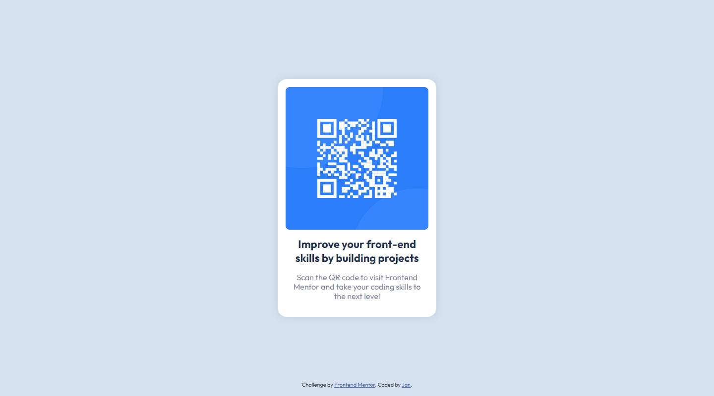

# Frontend Mentor - QR code component solution

This is a solution to the [QR code component challenge on Frontend Mentor](https://www.frontendmentor.io/challenges/qr-code-component-iux_sIO_H). Frontend Mentor challenges help you improve your coding skills by building realistic projects. 

## Table of contents

- [Overview](#overview)
  - [Screenshot](#screenshot)
  - [Links](#links)
- [My process](#my-process)
  - [Built with](#built-with)
  - [What I learned](#what-i-learned)
  - [Useful resources](#useful-resources)
- [Author](#author)
- [Acknowledgments](#acknowledgments)

## Overview

### Screenshot

|  |  |
| ----------- | ----------- |
| Mobile | Desktop |

### Links

- Solution URL: [Github Repo](https://github.com/Negligence/qr-code-component.git)
- Live Site URL: [Github Pages](https://negligence.github.io/qr-code-component/)

## My process

### Built with

- Semantic HTML5 markup
- CSS custom properties
- CSS Grid
- Mobile-first workflow

### What I learned

I used main, article, and footer tags for Semantic HTML. Feel free to send me feedback if my tag usage is incorrect.

```html
  <main>
    <article>
      
      <h1>Improve your front-end skills by building projects</h1>
      <p>Scan the QR code to visit Frontend Mentor and take your coding skills to the next level</p>
    </article>
  </main>
  
  <footer>
    Challenge by <a href="https://www.frontendmentor.io/challenges/qr-code-component-iux_sIO_H" target="_blank">Frontend Mentor</a>. 
    Coded by <a href="https://www.facebook.com/jan.panado/" target="_blank">Jan</a>.
  </footer>
```

The #region and #endregion comments are syntax for VSCode Regions. It enables code folding when you want to organize and segment your code by regions. Here's a helpful link to [learn more](https://code.visualstudio.com/docs/editor/codebasics#_folding).

Setting the html document's height to 100% will allow the body content to use the inherit value for its own height. I also created custom css variables to make it easier to generate Trigger Suggest variables with VSCode's Ctrl + Space, as well as make it easier to change default values later on along the line. The :not() pseudo-class selector here is to target everything that isn't a list and remove default browser margins and paddings.

```css
/* #region Defaults */
html {
  box-sizing: border-box;
  height: 100%;
  --light-gray: hsl(212, 45%, 89%);
  --grayish-blue: hsl(220, 15%, 55%);
  --dark-blue: hsl(218, 44%, 22%);
  --ff-head: 'Outfit', sans-serif;
  --fw-title:700;
  --fw-sub:400;
}

*,*::before,*::after {box-sizing: inherit;}

:not(ul, ol, li) {margin: 0;padding: 0;}

h1,h2,h3,h4,h5,h6,p,a,footer {font-family: var(--ff-head);}

h1,h2,h3,h4,h5,h6 {font-weight: var(--fw-title);color: var(--dark-blue);}

p {font-weight: var(--fw-sub);color: var(--grayish-blue);}
/* #endregion Defaults */
```

CSS Grid's place-content property really comes in handy here to center the component on the page, take note though that to make it work you need to set a height the parent container. In this case, the height is set to inherit 100% from its parent html element. 

```css
body {
  background: var(--light-gray);
  height: inherit;
  display: grid;
  place-content: center;
  text-align: center;
}
```

Declaring 100% width on the child image will make it take up the 100% of the space relative to the declared width of its parent container.

```css
article img {width: 100%;}
```

I costrained the compenent's width using the max-width property and used the calc() function to subract 2 rem from the mobile width provided in the sytle-guide.md, while CSS Grid's sap property becomes very useful in this situation when you need to apply spacing between your elements instead of margin.

```css
article {
  background: white;
  padding: 1rem;
  max-width: calc(375px - 2rem);
  display: grid;
  gap: 1.2rem;
}
```

Though the gap property is handy to use, in can't apply space after the last child, so here I made use of the direct child selector to target the :last-child() and applied margin-block-end, a CSS logical property which is similar to margin bottom. I also converted my font pixel values to rem by dividing the original pixel value by 16. By converting the font-size to rem, it will compute the size according to the browser's default font size settings and will change if that setting is ever modified.

```css
article > :last-child {
  margin-block-end: 1.2rem;
  padding-inline: 1.2rem;
  font-size: 0.9375rem ;
}
```

I kept Front End Mentor's attribution text, and applied a fixed position to the bottom of the page using the inset shorthand property insted of the tradional top, right, bottom, and left properties. The inset shorthand property here targets Top | Left&Right | Bottom values respectively, note that the auto value here is the same as not setting a value for the Top property.

```css
footer {
  font-size: 0.6875rem;
  position: fixed;
  inset: auto 0 1rem;
}
```

### Useful resources

- [Build a responsive website from scratch with HTML & CSS | Part 1: Navigation bar](https://www.youtube.com/watch?v=8w_kHIAkucA&t=7s) - I learned about converting pixel values to REM from Coder Coder
- [Simpler positioning with inset and auto](https://www.youtube.com/watch?v=8mv1HJgh6-o) - Found out about inset from Kevin Powel

## Author

- Frontend Mentor - [@Negligence](https://www.frontendmentor.io/profile/Negligence)
- Github - [Negligence](https://github.com/Negligence)
- Twitter - [@IEImNothing](https://twitter.com/IEImNothing)
- Twitch - [Arrogant_Negligence](https://www.twitch.tv/arrogant_negligence)
- Youtube - [Jan Panado](https://www.youtube.com/channel/UC4ojhHYmkHptu2JpyKtrL-w)
- LinkedIn - [Jan Panado](https://www.linkedin.com/in/janp-09/)
- Facebook - [Jan Panado](https://www.facebook.com/jan.panado)
- Website - [Jan Panado](https://jan-panado.com/)

## Acknowledgments

Hat's off to [Coder Coder](https://www.youtube.com/c/TheCoderCoder) and [Kevin Powell](https://www.youtube.com/kepowob) for making very useful videos for coding noobs like me.